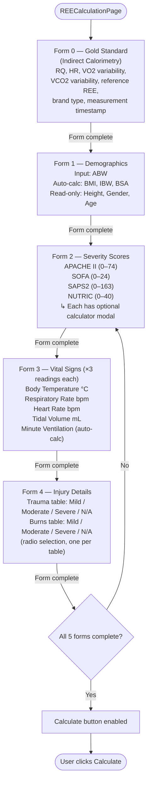
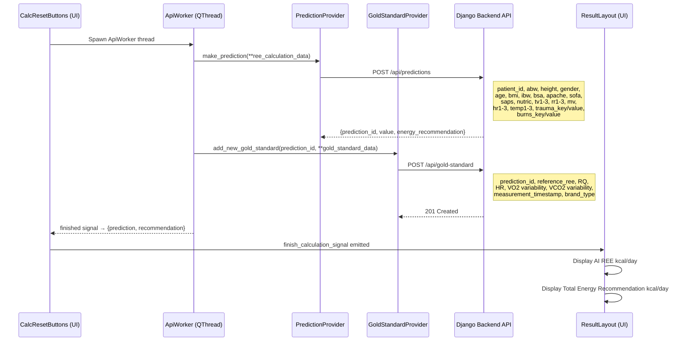
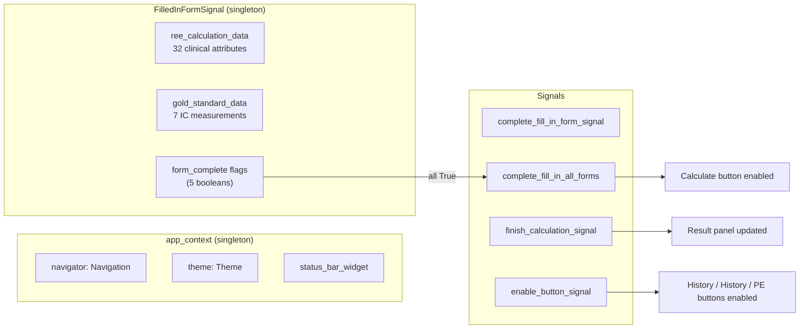
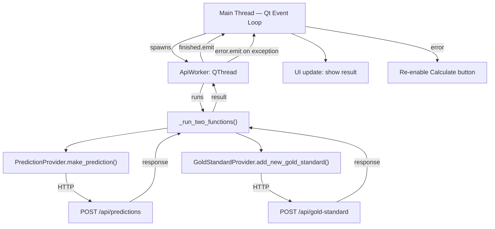

# frontend_innutrire — Flow Diagram

> **What it is:** A PySide6 desktop application (compiled to a Windows `.exe`) that runs on bedside tablets in the ICU. Clinicians use it to register patients, enter clinical measurements, and trigger REE (Resting Energy Expenditure) predictions from the Django backend.

---

## Application Navigation & Screen Flow

```mermaid
flowchart TD
    A([run.py — QApplication Launch]) --> B[MainWindow created]
    B --> C[Navigation: QStackedWidget initialised]
    C --> D[SELECT_PATIENT_PAGE]

    D --> E{User action}
    E -->|Click Add Patient| F[AddNewPatientPage]
    E -->|Click existing patient row| G[PatientDashboardPage]

    F --> F1["Fill form\n(name, RN, race, gender,\nDOB, bed_no, height)"]
    F1 --> F2["Save →\nPOST /api/patients"]
    F2 --> D

    G --> G1["GET /api/patients/{id}"]
    G --> G2["GET /api/patients/{id}/latest-prediction"]
    G --> G3["GET /api/patients/{id}/insights"]
    G1 & G2 & G3 --> H[Dashboard rendered]

    H --> I{User action}
    I -->|REE Calculation| J[REECalculationPage]
    I -->|History| K[REEHistoryPage]
    I -->|Predictive Equations| L[PredictiveEquationsPage]
    I -->|Edit| M[EditPatientPage]
    I -->|Patient Consent| N["POST /api/patients/{id}/consent"]
```

---

## REE Calculation Wizard (5-Step Form)

---

## Prediction Submission & Result Display

---

## State Management

---

## Threading Architecture

---

## API Surface Consumed

| Method | Endpoint | Purpose |
|--------|----------|---------|
| GET | `/api/patients` | List all patients |
| POST | `/api/patients` | Register new patient |
| GET | `/api/patients/{id}` | Patient detail |
| PUT | `/api/patients/{id}` | Update patient |
| DELETE | `/api/patients/{id}` | Soft-delete patient |
| POST | `/api/patients/{id}/consent` | Record consent |
| GET | `/api/patients/{id}/latest-prediction` | Most recent REE result |
| GET | `/api/patients/{id}/predictions` | All REE history |
| GET | `/api/patients/{id}/insights` | Latest vs previous delta |
| POST | `/api/predictions` | **Run ML inference → REE result** |
| POST | `/api/gold-standard` | Store IC calorimetry measurement |
