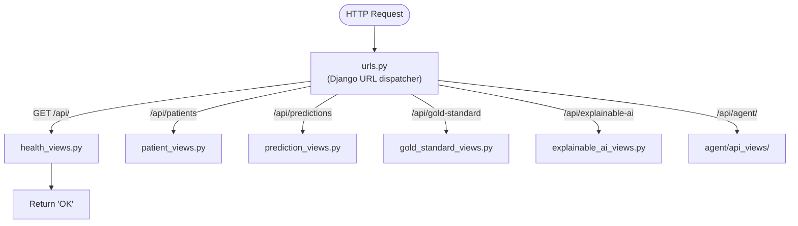
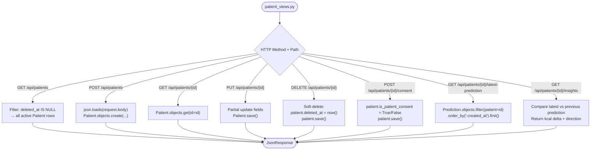
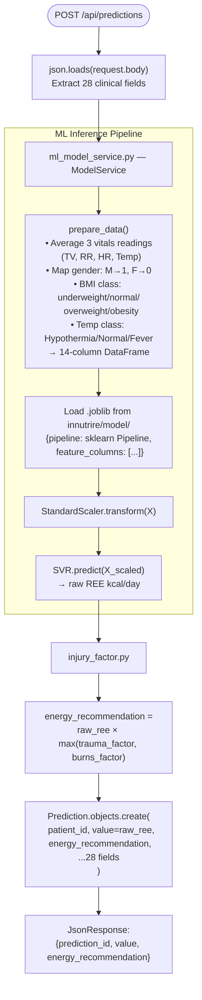
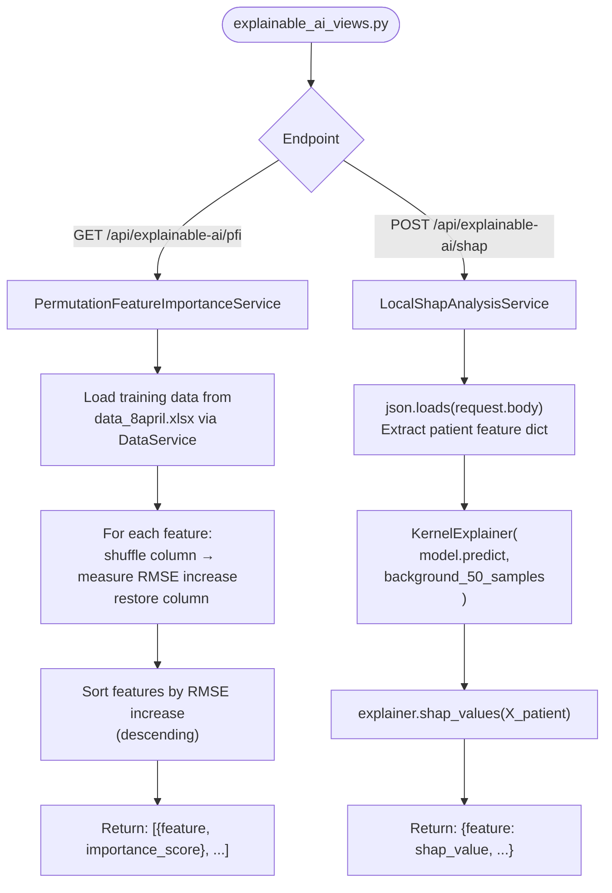
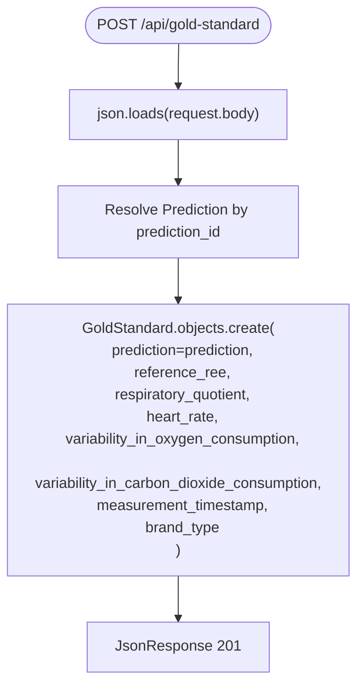
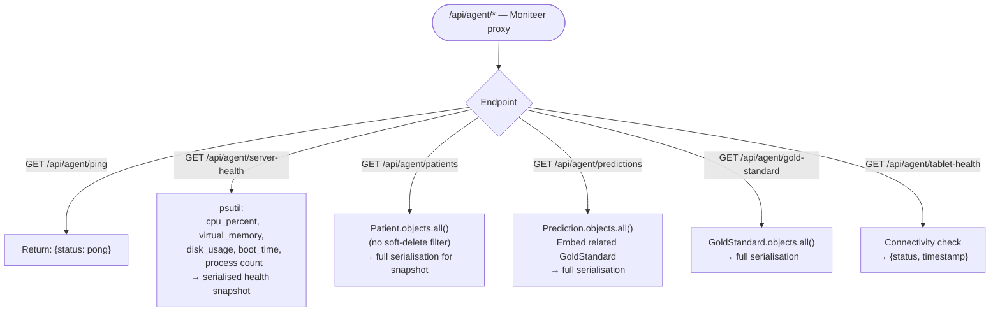
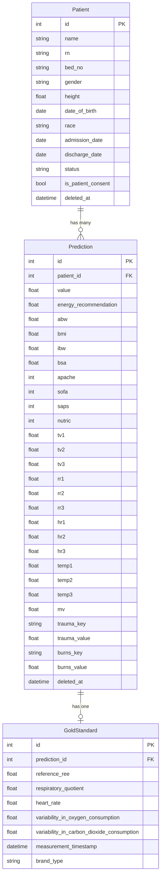
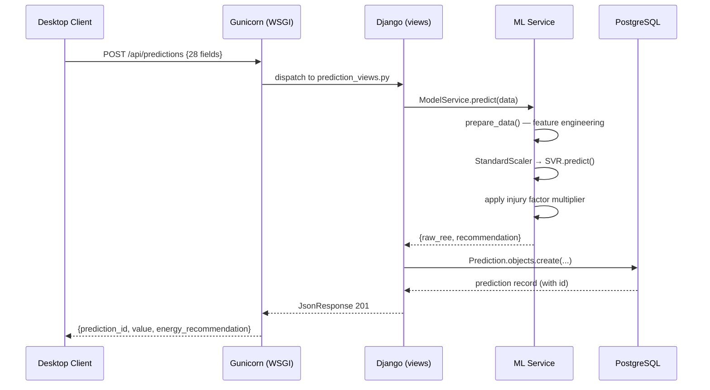

# django_backend_innutrire — Flow Diagram

> **What it is:** A Django 6 / Django REST Framework backend exposing a JSON REST API. It handles patient records, runs ML inference for REE prediction via a trained SVR pipeline, provides explainable AI outputs (SHAP + PFI), stores gold-standard calorimetry measurements, and proxies monitoring data for the Moniteer agent.

---

## Request Routing Overview

---

## Patient Endpoint Flow

---

## Prediction & ML Inference Flow

---

## Explainable AI Flow

---

## Gold Standard Endpoint Flow

---

## Agent Proxy Flow (Moniteer)

---

## Data Models

---

## Request Lifecycle (Full Stack View)

