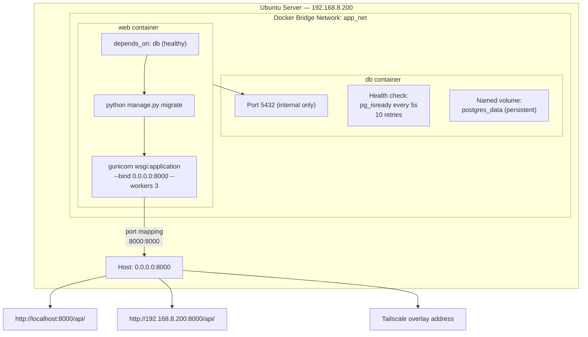
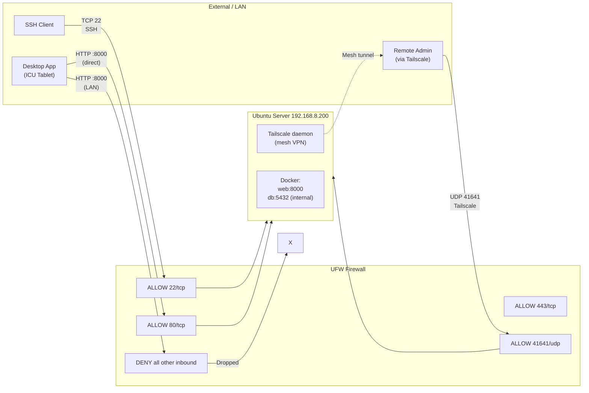
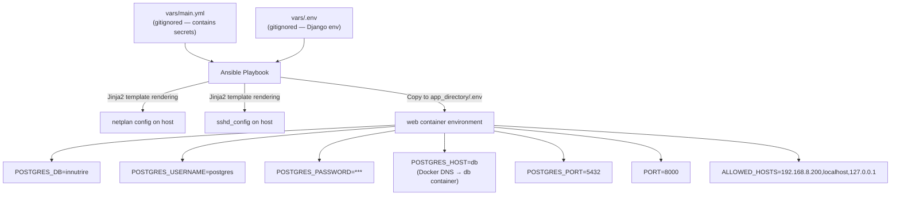

# hospital-server-deployment-iac — Flow Diagram

> **What it is:** An Ansible-based Infrastructure-as-Code project that fully provisions an on-premise Ubuntu server from scratch — users, networking, SSH, VPN, firewall, Docker — and deploys the Django backend via Docker Compose.

---

## Ansible Playbook Execution Flow

```mermaid
flowchart TD
    ENG([Engineer: ansible-playbook playbook.yaml\n--ask-become-pass]) --> INV

    INV["inventory.ini\nhost: 127.0.0.1\nconnection: local\n(runs ON the server itself)"]

    INV --> VARS["Load vars/main.yml\n(passwords, Tailscale key, git URL,\nPAT, network config, app directory)"]

    VARS --> T1

    subgraph Phase1["Phase 1 — Users (01-create-users.yaml)"]
        T1["Create system users:\nhakim + fadzwan"]
        T1 --> T1A["Add to groups:\nsudo + docker"]
    end

    T1A --> T2

    subgraph Phase2["Phase 2 — Network (02-configure-network.yaml)"]
        T2["Render netplan-static-ip.yaml.j2\ninterface: eth0\nIP: 192.168.8.200/24\ngateway: 192.168.8.1\nDNS: 8.8.8.8 / 8.8.4.4"]
        T2 --> T2H["Handler: netplan apply"]
    end

    T2H --> T3

    subgraph Phase3["Phase 3 — SSH (03-configure-ssh.yaml)"]
        T3["Render sshd_config.j2\nAllowUsers: hakim fadzwan\nMaxAuthTries: 3\nPort: 22\nRoot login: prohibited"]
        T3 --> T3H["Handler: Restart SSH service"]
    end

    T3H --> T4

    subgraph Phase4["Phase 4 — VPN (04-configure-tailscale.yaml)"]
        T4["Install Tailscale package"]
        T4 --> T4A["tailscale up\n--authkey=tailscale_auth_key"]
        T4A --> T4B["Overlay mesh network connected"]
    end

    T4B --> T5

    subgraph Phase5["Phase 5 — Firewall (05-configure-ufw.yaml)"]
        T5["ufw allow 22/tcp   ← SSH"]
        T5 --> T5A["ufw allow 80/tcp   ← HTTP"]
        T5A --> T5B["ufw allow 443/tcp  ← HTTPS"]
        T5B --> T5C["ufw allow 41641/udp ← Tailscale"]
        T5C --> T5D["ufw enable\n(default: deny inbound)"]
    end

    T5D --> T6

    subgraph Phase6["Phase 6 — Docker (06-install-docker.yaml)"]
        T6["Install Docker Engine\n+ Compose plugin"]
        T6 --> T6A["Ensure users in docker group"]
    end

    T6A --> T7

    subgraph Phase7["Phase 7 — App Deploy (07-deploy-django.yaml)"]
        T7["git clone\nhttps://PAT@github.com/.../django_backend_innutrire"]
        T7 --> T7A["Copy vars/.env →\napp_directory/.env"]
        T7A --> T7B["docker compose up --build -d"]
    end
```

---

## Docker Compose Architecture

---

## Network & Security Architecture

---

## Environment Variable Flow

---

## Deployment Idempotency Notes

| Task | Idempotent? | Notes |
|------|-------------|-------|
| Create users | Yes | `state: present` |
| Configure Netplan | Yes | Template overwrite + handler |
| Configure SSH | Yes | Template overwrite + handler |
| Install Tailscale | Yes | Package install check |
| Configure UFW rules | Yes | Rule already exists = skip |
| Install Docker | Yes | Package install check |
| Git clone + deploy | **Partially** | Removes `app_directory` before re-clone |
