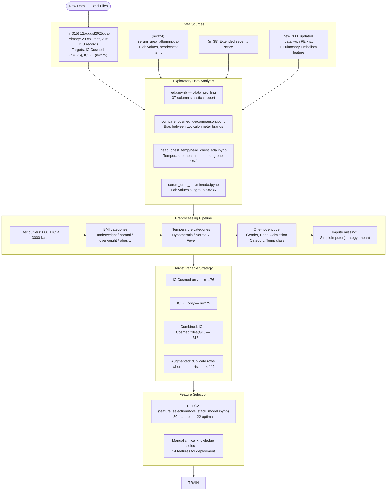
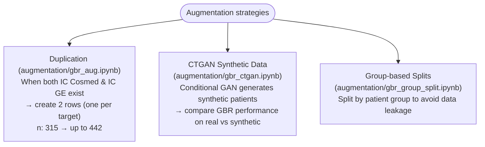
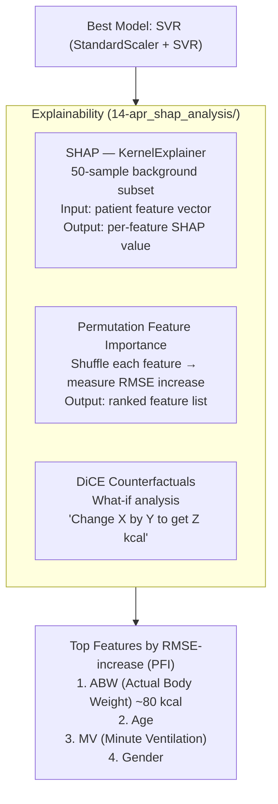
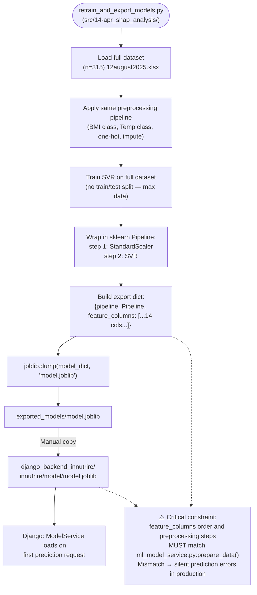
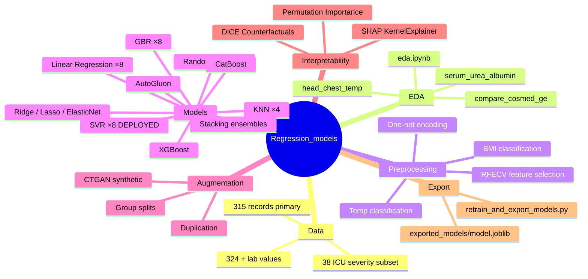

# Regression_models_innutrire — Flow Diagram

> **What it is:** The ML research repository for INNUTRIRE. It contains 87 Jupyter notebooks that systematically explore data, compare regression algorithms, and converge on the best model for predicting ICU patient Resting Energy Expenditure (REE) in kcal/day. The winning model is exported as a `.joblib` artifact and deployed into the Django backend.

---

## Overall Research Workflow

---

## Model Training & Evaluation

```mermaid
flowchart TD
    TRAIN(["Features ready"]) --> CV["5-Fold KFold\n(shuffle=True, random_state=42)"]

    CV --> MODELS

    subgraph MODELS["Algorithms Explored (87 notebooks total)"]
        M1["Linear Regression\n(8 variants: Cosmed, GE, combined, SOFA, SAPS2, NUTRIC, NUTRIC, original)"]
        M2["Ridge / Lasso / Elastic Net\n(regularised linear)"]
        M3["Random Forest Regressor\n(GridSearchCV + 5-fold)"]
        M4["Gradient Boosting Regressor\n(GridSearchCV, quantile variant, LR-correction)"]
        M5["Support Vector Regressor ★\n(StandardScaler + SVR — DEPLOYED)"]
        M6["KNN Regressor\n(k=5/7)"]
        M7["XGBoost"]
        M8["CatBoost\n(tuned in best_model_catboost.ipynb)"]
        M9["AutoGluon TabularPredictor\n(weighted ensemble of 10 base models)"]
        M10["Stacking: RFR + GBR + Ridge → LinearRegression"]
        M11["KMeans(k=3) + per-cluster LR"]
        M12["Deep Learning: SVM + RFR + Dense NN"]
    end

    MODELS --> EVAL

    subgraph EVAL["Evaluation Metrics"]
        E1["RMSE — primary metric"]
        E2["R² — explained variance"]
        E3["MAPE, MAE"]
        E4["±10% and ±20% accuracy bands"]
        E5["Benchmark against 9 published Predictive Equations\n(Harris-Benedict 1919, Penn State,\nMifflin-St Jeor, Ireton-Jones, TAH, etc.)"]
    end

    EVAL --> RESULTS

    subgraph RESULTS["Key Results (model_comparison.ipynb, IC GE test set)"]
        R1["SVR         — RMSE=314 kcal  R²=0.42 ★ BEST ML"]
        R2["Random Forest — RMSE=317 kcal R²=0.41"]
        R3["H-B 1919 PE — RMSE=327 kcal  R²=0.37  (best PE)"]
        R4["Linear Reg  — RMSE=348 kcal  R²=0.29"]
        R5["XGBoost     — RMSE=354 kcal  R²=0.26"]
        R6["TAH Eq PE   — RMSE=1099 kcal (worst)"]
    end
```

---

## Data Augmentation Experiments

---

## Interpretability Analysis

---

## Model Export for Deployment

---

## Repository Structure at a Glance

