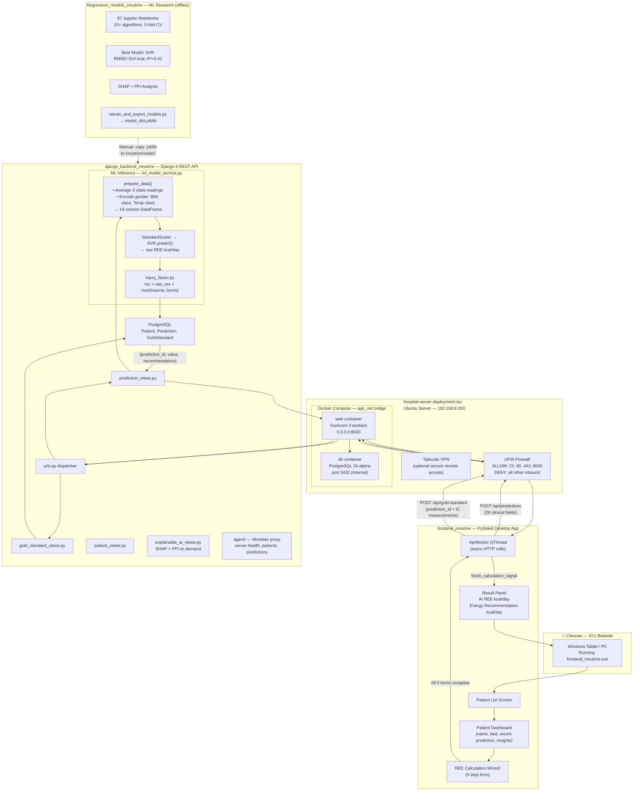
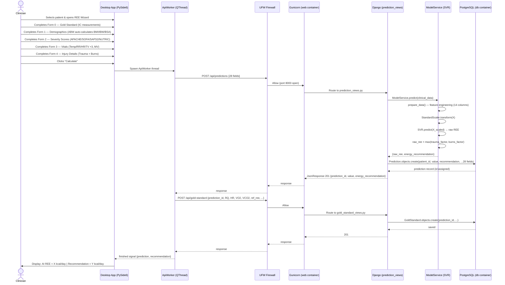
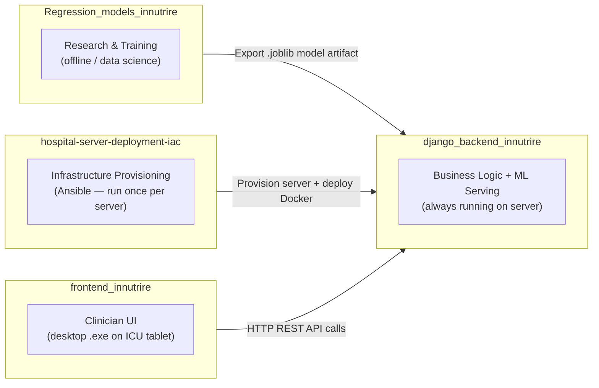
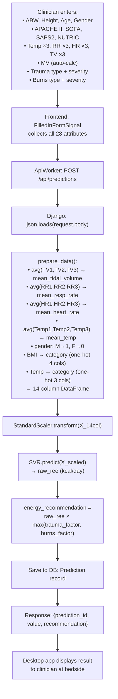
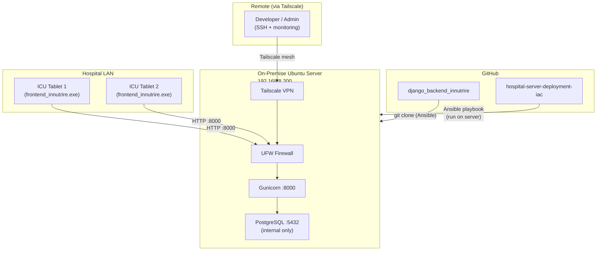

# INNUTRIRE — System Overview Diagram

> End-to-end flow from a clinician making a prediction request to the result being displayed on the ICU bedside app. Spans all four repositories.

---

## Full System Architecture

---

## Prediction Request: Step-by-Step Sequence

---

## Repository Roles Summary

---

## Data Flow: From Patient Vitals to REE Prediction

---

## Infrastructure Topology

